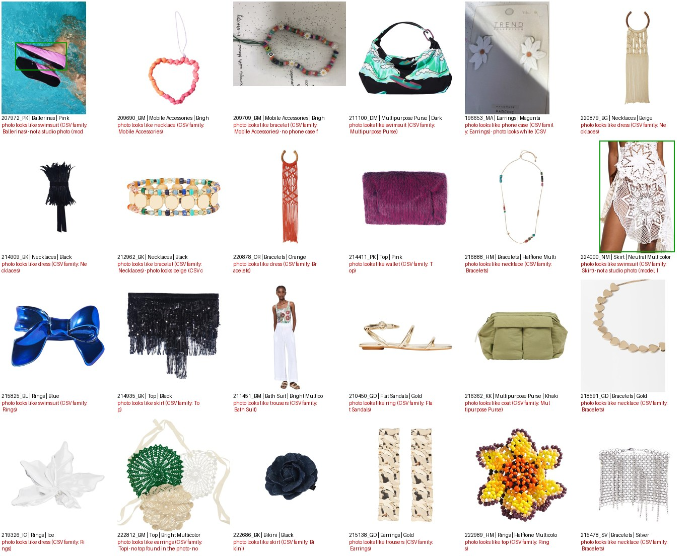
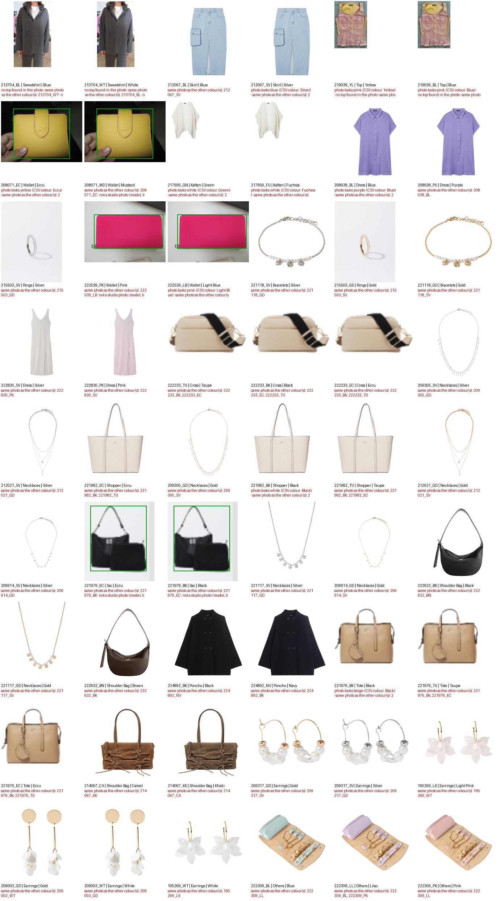

# Progress Log: Parfois Similarity Project

What has been done so far, with evidence. The plan and the open checklist are in [ROADMAP.md](ROADMAP.md).

**Status on 2026-10-09:** Sprint 1 (data cleaning and validation) is in progress.
- ✅ Automatic data checks.
- ✅ Image pre-screen with AI (masks + CLIP).
- ✅ Review app for the team.
- 🟡 Manual review by the 5 members, then merge.

---

## At a glance

| | |
|---|---|
| Products (SKUs / colourways) | 17,125 SKUs → **10,555 colourways** (model × colour), the unit of analysis |
| Photos | 9,496 files, **9,455 colourways (89.6%)** with a photo |
| Automatic checks | 21 checks on codes, text, images and sizes. **29 high, 578 medium, 351 low priority** products |
| Image AI | 9,457 photos masked and embedded (512 numbers each) in 86 min on one laptop CPU |
| Image flags | **24** photos of another item type, **132** of another colour, **54** same photo for another colour |
| Review | 5 balanced batches (2,111 products each), browser app, autosave, one-click submit |

---

## 1. Understanding the data (2026-10-07)

- **Data dictionary** for all 141 product columns and the sales file: [data_description.md](data_description.md).
- **Key findings:**
  - one row per SKU (size), so the work happens per colourway (`PROD_CLR_EQUIV`);
  - sales join with no orphans;
  - 33 columns are empty or constant;
  - hidden non-breaking spaces in the text.
- **Architecture decision:** a deterministic retrieval pipeline, **not a multi-agent system**: [ROADMAP.md § Architecture](ROADMAP.md#architecture-decision-no-multi-agent-system-mas-in-the-product).

## 2. Automatic checks (Sprint 1, 2026-10-07 → 09)

- **Script:** `src/sprint1_preprocess.py check`. It takes about 15 s on the full dataset.
- **Report:** [outputs/sprint1/check_report.md](outputs/sprint1/check_report.md).
- **What it checks:**
  - **Keys and duplicates:** none found.
  - **Missing values:** a full table of empty and constant columns.
  - **Image paths and files:** 1 invalid path, 1 corrupt file, 1,100 colourways without a photo.
  - **Image file name vs product code, colour and category:** 252 generic photos, 100 shared photos.
  - **Colour code ↔ colour name ↔ description, and description type ↔ family.**
  - **Sizes of the same colourway that disagree:** 165 colourways, e.g. a different price or theme per size. The value most sizes share is used, and the product is flagged.
- **Audit by a teammate:** Pedro Meireles's AI audit ([SPRINT1_REVIEW_AND_ROADMAP.md](SPRINT1_REVIEW_AND_ROADMAP.md)) found 3 bugs. All were fixed on 2026-10-09.

## 3. Image pre-screen with AI (Phase 1b, 2026-10-09)

The professor warned that some photos don't match their row (e.g. the row says necklace, the photo shows earrings) and suggested **masks** for photos where a model wears several items.

**How:** `src/phase1b_image_audit.py`, run once on one laptop. Results are committed to `data/embeddings/`, so nobody else has to run it.

1. **Mask:**
   - white-background photos (97%) are cropped to the product;
   - photos of models, lifestyle shots and white-background photos with a person are cropped with an object detector (OWLv2), prompted with the CSV item type (e.g. "earrings").
2. **Embed:** each cropped product goes through CLIP and becomes **512 numbers** ("an image as a token"). Comparing products is then simple maths: all 90 million pairs take about 1 second.
3. **Check:**
   - item type (15 broad types) vs the CSV family;
   - colour vs `CLR_DES`;
   - the same photo used for another colour;
   - not a studio photo.
4. **Calibrate:** every flag type was inspected on contact sheets and the thresholds tuned. Flags fell from about 1,400 to about 700.

**Report:** [outputs/phase1b/image_audit_report.md](outputs/phase1b/image_audit_report.md).

**Photos that look like another item type** (24 high-priority flags). Examples: a "bath suit" photo showing an outfit, a "top" that looks like a skirt, ballerinas photographed in a swimming pool:

**Same photo for another colour** (54). Examples: the white and the blue sweatshirt, the blue and the silver skirt, the black and the taupe bag share one photo:

**Photo shows another colour** (132): [contact sheet](outputs/phase1b/vis_colour_mismatch.jpg).

**Not a studio photo** (272): [contact sheet](outputs/phase1b/img_not_packshot.jpg).

These are **suggestions for the reviewers**, not verdicts. After the review, the decisions will measure each flag's real precision.

## 4. Review workflow for the team (2026-10-08 → 09)

- **Setup:** double-click `1_setup_windows.bat` / `1_setup_mac.command`. See [README.md](README.md).
- **Review app:** double-click `2_review_…`, type your number, and the browser opens:
  - each product as a card with its photo, data and flags in plain words;
  - buttons: Looks right / Wrong photo / Fix data / Not sure / Discard;
  - every click saved automatically;
  - **Submit** sends your file to GitHub.

| # | Member | Batch |
|---|---|---|
| 1 | André | `batch_01_of_05` |
| 2 | Pedro Correia | `batch_02_of_05` |
| 3 | Pedro Meireles | `batch_03_of_05` |
| 4 | Manuel | `batch_04_of_05` |
| 5 | Zé | `batch_05_of_05` |

- **Merge:** `3_merge_…` applies all decisions and logs every change. It produces the clean dataset `data/processed/items_clean.parquet`, the Sprint 1 deliverable. Products still unresolved stay out until the team decides.

## 5. Compute strategy (2026-10-09)

**Encode once, reuse everywhere.**
- Heavy models run on one machine only.
- The results (≈10 MB of embeddings) are committed to the repository.
- Everyone else just loads small vectors: no GPU, no `torch`.

Details: [ROADMAP.md § Compute strategy](ROADMAP.md#compute-strategy-encode-once-reuse-everywhere).

---

## Next

1. Team calibration on ~20 flagged products, then everyone reviews their batch and submits.
2. Merge → clean dataset.
3. Sprint 2: tabular and text features (Phase 2a), then the similarity engine (Phase 3): ≥4 similar products per item, with explanations.
